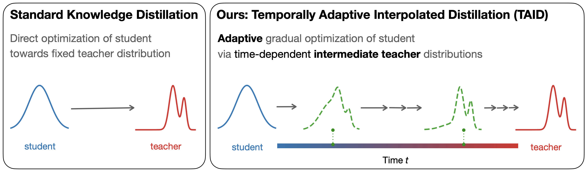

# TAID (ICLR 2025)

📚 [Paper](https://arxiv.org/abs/2501.16937) | 🤗 [Hugging Face](https://huggingface.co/SakanaAI) | 📝 Blog \[[EN](https://sakana.ai/taid/) | [JP](https://sakana.ai/taid-ja/)\]

<div align="center">

</div>

This is an official Pytorch implementation of "TAID: Temporally Adaptive Interpolated Distillation for Efficient Knowledge Transfer in Language Models".

## Installation

```bash
pip install torch==2.2.2 --index-url https://download.pytorch.org/whl/cu121
pip install -r requirements.txt
git clone https://github.com/Dao-AILab/flash-attention.git
cd flash-attention
python setup.py install

# make sure to login huggingface and wandb
huggingface-cli login
wandb login
```

We conducted our experiments in the following environment: Python Version 3.10.12 and CUDA Version 12.3 on 8 * H100 80GB.

## Data Preparation

This is the script to prepare data for [Phi-3-mini](https://huggingface.co/microsoft/Phi-3-mini-4k-instruct).

```bash
python prepare_ultrachat.py --model_type phi-3 --output_dir data
```

## Training

We provide bash scripts for various methods in the [scripts](./scripts) directory. For example, the scripts for the experiments distilling from Llama-2 to TinyLlama can be found in [scripts/llama-2](./scripts/llama-2) directory. For instance, running the following command will execute training with TAID.

```bash
bash scripts/llama-2/taid.sh
```

## Acknowledgement

We would like to thank the developers of the source models for their contributions and for making their work available.
The implmentation of baseline losses in [distil_losses](./src/distil_losses) and the sampling generation in [sampler.py](./src/sampler.py) is based on the following repositories, and we are grateful for their work.

- [DistiLLM: Towards Streamlined Distillation for Large Language Models (ICML 2024)](https://github.com/jongwooko/distillm)
- [MiniLLM: Knowledge Distillation of Large Language Models (ICLR 2024)](https://github.com/microsoft/LMOps/tree/main/minillm)

## Citation

To cite our work, you can use the following:

```bibtex
@misc{sakana2025taid,
      title         = {TAID: Temporally Adaptive Interpolated Distillation for Efficient Knowledge Transfer in Language Models}, 
      author.       = {Makoto Shing and Kou Misaki and Han Bao and Sho Yokoi and Takuya Akiba},
      year          = {2025},
      eprint        = {2501.16937},
      archivePrefix = {arXiv},
      primaryClass  = {cs.LG},
      url           = {https://arxiv.org/abs/2501.16937}
}
```
